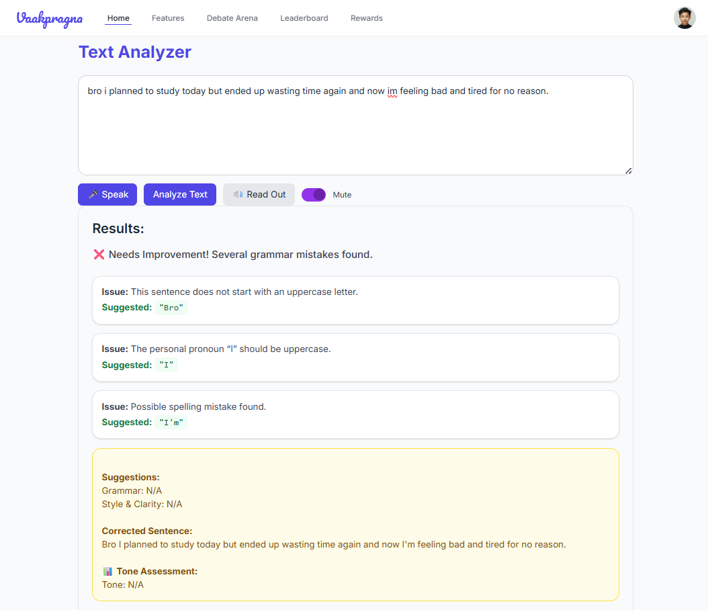
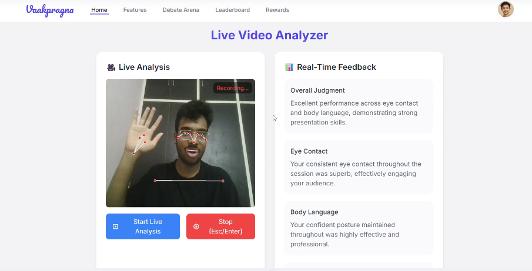
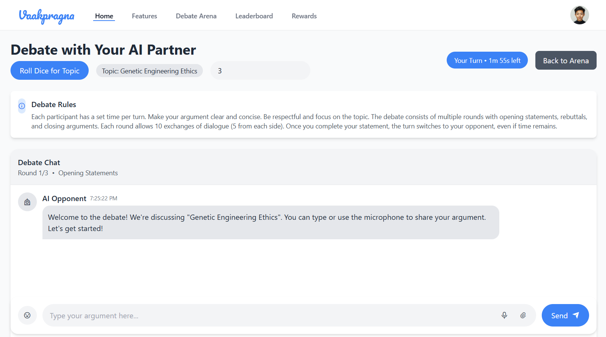
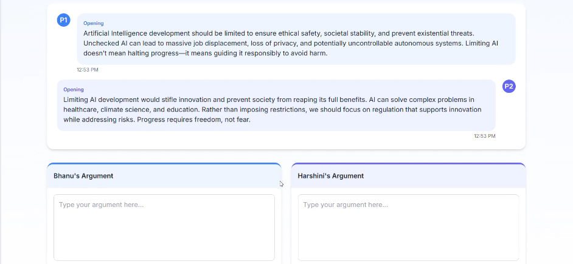
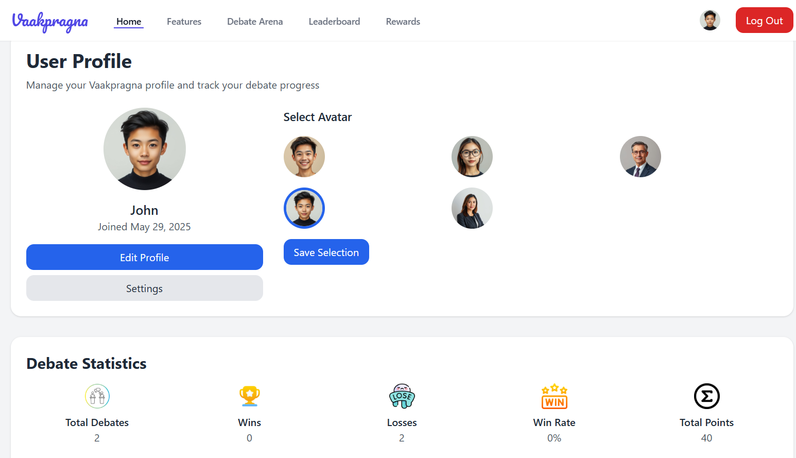

# 🗣️ Vaakpragna – AI Communication Companion

Vaakpragna is an **AI-driven communication training platform** designed to help users enhance their **public speaking, debating, and articulation skills** through **real-time analysis and intelligent feedback**.

The platform combines **facial gesture tracking, speech & text analysis, and an AI debate partner** to provide a complete, interactive learning experience.

---

## 🚀 Key Features

### 📝 1. AI Text Analyzer

Analyzes written or spoken content and provides detailed feedback on:

- Grammar and sentence structure  
- Clarity and coherence  
- Tone and formality  
- Suggestions for improvement  

#### 📸 Feature Preview


---

### 🎥  Video Analyzer (Live & Recorded)

Evaluates **non-verbal communication** using video input:

- Facial expressions  
- Eye contact and gaze tracking  
- Body posture  
- Confidence indicators  

The analysis runs in **near real-time**, making it suitable for **live practice**.

#### 📸 Feature Preview


---

### 🧠 Debate with AI

Engage in **structured debates** with an AI opponent:

- Topic-based debates  
- Turn-by-turn arguments  
- AI evaluates reasoning, logic, and rebuttal quality  
- Final winner declaration with improvement tips  

#### 📸 Feature Preview


---

### 🤝 Friend-vs-Friend Debate Mode

Users can:

- Create private debate rooms  
- Invite friends using room codes  
- Debate live  
- Get AI-generated feedback and leaderboard rankings  

#### 📸 Feature Preview


---

### 🏆 Leaderboard & User Profiles

- Tracks debate participation  
- Ranks users based on performance  
- Displays user profiles and activity statistics  

#### 📸 Feature Preview


---

### 🥇 Gamification & Rewards
Encourages continuous improvement through achievements.

- Badges for milestones
- Certificate eligibility
- Competitive leaderboards

## 📁 Project Structure

```text
Vaakpragna/
│
├── features/
│   ├── __init__.py
│   ├── debate_with_ai.py
│   ├── shape_predictor_68_face_landmarks.dat
│   ├── text_analyzer.py
│   └── video_analyzer.py
│
├── static/
│   ├── images/
│   │   ├── dice.png
│   │   └── vaaklogo.jpg
│   ├── js/
│   │   ├── auth.js
│   │   ├── debate.js
│   │   └── video-analyzer.js
│   └── style.css
│
├── templates/
│   ├── create_new_room.html
│   ├── debate-with-ai.html
│   ├── friend_vs_friend.html
│   ├── index.html
│   ├── leaderboard.html
│   ├── login_signup.html
│   ├── profile.html
│   ├── text-analyzer.html
│   └── video-analyzer.html
│
├── main.py
├── requirements.txt
└── users.db
```

---
## ⚙️ Installation & Setup

### Clone the Repository
```bash
git clone https://github.com/BhanuPrakashYarajarla/Vaakpragna.git
cd Vaakpragna
```

### Create and Activate Virtual Environment
```bash
python -m venv venv
source venv/bin/activate   # Windows: venv\Scripts\activate
```

### Install Dependencies
```bash
pip install -r requirements.txt
```

### Run the Application
```bash
python main.py
```

### Open in Browser
```
http://127.0.0.1:5000
```

---

## 🧠 Tech Stack

### 🔹 Backend
- Python
- Flask
- OpenCV
- dlib
- SQLite3

### 🔹 Frontend
- HTML
- CSS / Tailwind CSS
- JavaScript

### 🔹 AI & NLP
- Gemini / OpenAI APIs
- Speech & Text Processing
- Natural Language Processing (NLP)

---
## 🔮 Future Enhancements

- 👀 **Spectator Mode**  
  Allow users to spectate live debates between participants and view AI-generated feedback in real time.

- 📊 **Advanced Analytics Dashboard**  
  Detailed insights into user performance trends, confidence levels, and speaking improvements over time.

- 🌐 **Multilingual Support**  
  Support for multiple languages in speech, text analysis, and debate interactions.

- 📱 **Mobile Application**  
  Android and iOS apps for on-the-go practice and learning.

- 🤖 **Emotion & Sentiment Detection**  
  Analyze emotional cues from facial expressions and speech tone.

- 🏅 **Enhanced Gamification System**  
  Unlock achievements, certificates, and ranks based on user milestones.

---

## 🏅 Milestone System

| Badge Level | Requirement | Rewards |
|------------|-------------|---------|
| 🥉 **Bronze Badge** | Complete **25 debates** | Bronze badge unlocked |
| 🥈 **Silver Badge** | Complete **50 debates** | Silver badge unlocked |
| 🥇 **Gold Badge** | Complete **100+ debates** | Gold badge + Certificate of Achievement |

---
## 👥 Contributors

| Name | Role | Contribution |
|------|------|--------------|
| **Bhanu Prakash** | Backend Developer | Core backend development, AI integration, database design |
| **Sree Harshini** | Frontend Developer | UI development, frontend logic, user interaction flows |


